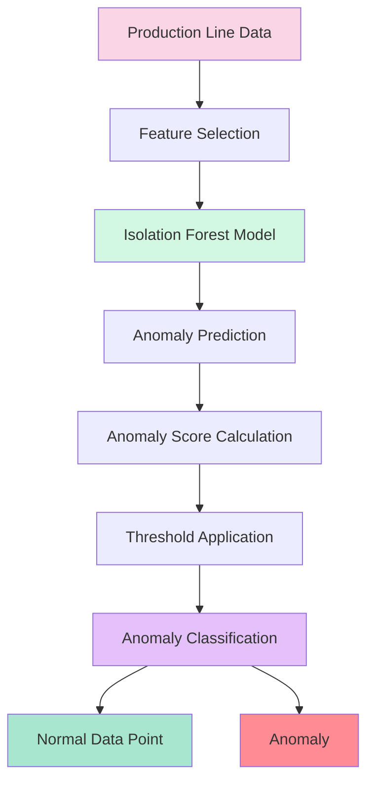

```mermaid
graph TD;
    A["Production Line Data"]-->B["Feature Selection"]
    B-->C["Isolation Forest Model"]
    C-->D["Anomaly Prediction"]
    D-->E["Anomaly Score Calculation"]
    E-->F["Threshold Application"]
    F-->G["Anomaly Classification"]
    G-->H1["Normal Data Point"]
    G-->H2["Anomaly"]
    
    style A fill:#f9d5e5
    style C fill:#d3f8e2
    style G fill:#e4c1f9
    style H1 fill:#a8e6cf
    style H2 fill:#ff8b94
```