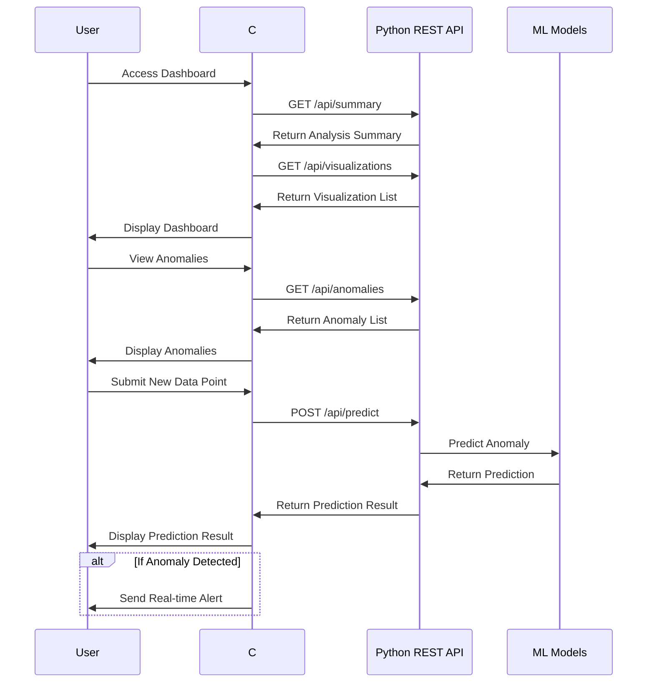

```mermaid
sequenceDiagram
    participant User
    participant CSharp as C# Web Application
    participant PythonAPI as Python REST API
    participant ML as ML Models
    
    User->>CSharp: Access Dashboard
    CSharp->>PythonAPI: GET /api/summary
    PythonAPI->>CSharp: Return Analysis Summary
    CSharp->>PythonAPI: GET /api/visualizations
    PythonAPI->>CSharp: Return Visualization List
    CSharp->>User: Display Dashboard
    
    User->>CSharp: View Anomalies
    CSharp->>PythonAPI: GET /api/anomalies
    PythonAPI->>CSharp: Return Anomaly List
    CSharp->>User: Display Anomalies
    
    User->>CSharp: Submit New Data Point
    CSharp->>PythonAPI: POST /api/predict
    PythonAPI->>ML: Predict Anomaly
    ML->>PythonAPI: Return Prediction
    PythonAPI->>CSharp: Return Prediction Result
    CSharp->>User: Display Prediction Result
    
    alt If Anomaly Detected
        CSharp->>User: Send Real-time Alert
    end
```