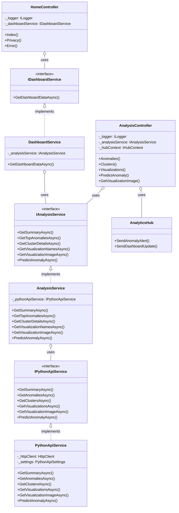

```mermaid
classDiagram
    class IPythonApiService {
        <<interface>>
        #43;GetSummaryAsync()
        #43;GetAnomaliesAsync()
        #43;GetClustersAsync()
        #43;GetVisualizationsAsync()
        #43;GetVisualizationImageAsync()
        #43;PredictAnomalyAsync()
    }
    
    class PythonApiService {
        #45;_httpClient: HttpClient
        #45;_settings: PythonApiSettings
        #43;GetSummaryAsync()
        #43;GetAnomaliesAsync()
        #43;GetClustersAsync()
        #43;GetVisualizationsAsync()
        #43;GetVisualizationImageAsync()
        #43;PredictAnomalyAsync()
    }
    
    class IAnalysisService {
        <<interface>>
        #43;GetSummaryAsync()
        #43;GetTopAnomaliesAsync()
        #43;GetClusterDetailsAsync()
        #43;GetVisualizationNamesAsync()
        #43;GetVisualizationImageAsync()
        #43;PredictAnomalyAsync()
    }
    
    class AnalysisService {
        #45;_pythonApiService: IPythonApiService
        #43;GetSummaryAsync()
        #43;GetTopAnomaliesAsync()
        #43;GetClusterDetailsAsync()
        #43;GetVisualizationNamesAsync()
        #43;GetVisualizationImageAsync()
        #43;PredictAnomalyAsync()
    }
    
    class IDashboardService {
        <<interface>>
        #43;GetDashboardDataAsync()
    }
    
    class DashboardService {
        #45;_analysisService: IAnalysisService
        #43;GetDashboardDataAsync()
    }
    
    class HomeController {
        #45;_logger: ILogger
        #45;_dashboardService: IDashboardService
        #43;Index()
        #43;Privacy()
        #43;Error()
    }
    
    class AnalysisController {
        #45;_logger: ILogger
        #45;_analysisService: IAnalysisService
        #45;_hubContext: IHubContext
        #43;Anomalies()
        #43;Clusters()
        #43;Visualizations()
        #43;PredictAnomaly()
        #43;GetVisualizationImage()
    }
    
    class AnalyticsHub {
        #43;SendAnomalyAlert()
        #43;SendDashboardUpdate()
    }
    
    IPythonApiService <|.. PythonApiService : implements
    IAnalysisService <|.. AnalysisService : implements
    IDashboardService <|.. DashboardService : implements
    
    AnalysisService o-- IPythonApiService : uses
    DashboardService o-- IAnalysisService : uses
    HomeController o-- IDashboardService : uses
    AnalysisController o-- IAnalysisService : uses
    AnalysisController o-- AnalyticsHub : uses

```