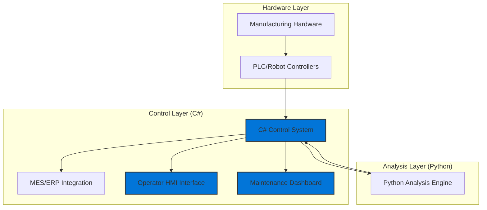

```mermaid
graph TD;
    A["Manufacturing Hardware"]-->B["PLC/Robot Controllers"]
    B-->C["C# Control System"]
    C-->D["Python Analysis Engine"]
    D-->C
    C-->E["MES/ERP Integration"]
    C-->F["Operator HMI Interface"]
    C-->G["Maintenance Dashboard"]
    
    subgraph "Hardware Layer"
    A
    B
    end
    
    subgraph "Control Layer (C#)"
    C
    E
    F
    G
    end
    
    subgraph "Analysis Layer (Python)"
    D
    end
    
    style C fill:#0275d8,stroke:#333,stroke-width:2px
    style F fill:#0275d8,stroke:#333,stroke-width:2px
    style G fill:#0275d8,stroke:#333,stroke-width:2px
```