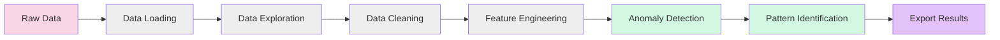

```mermaid
graph LR;
    A["Raw Data"]-->B["Data Loading"]
    B-->C["Data Exploration"]
    C-->D["Data Cleaning"]
    D-->E["Feature Engineering"]
    E-->F["Anomaly Detection"]
    F-->G["Pattern Identification"]
    G-->H["Export Results"]
    
    style A fill:#f9d5e5
    style B fill:#eeeeee
    style C fill:#eeeeee
    style D fill:#eeeeee
    style E fill:#eeeeee
    style F fill:#d3f8e2
    style G fill:#d3f8e2
    style H fill:#e4c1f9
```