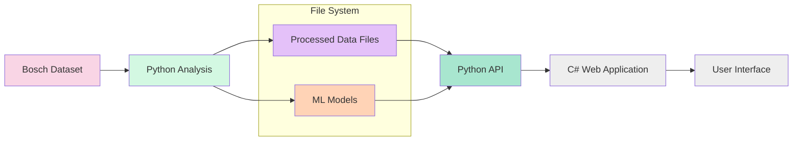

```mermaid
graph LR;
    A["Bosch Dataset"]-->B["Python Analysis"]
    B-->C["Processed Data Files"]
    B-->D["ML Models"]
    C-->E["Python API"]
    D-->E
    E-->F["C# Web Application"]
    F-->G["User Interface"]
    
    subgraph "File System"
    C
    D
    end
    
    style A fill:#f9d5e5
    style B fill:#d3f8e2
    style C fill:#e4c1f9
    style D fill:#ffd3b6
    style E fill:#a8e6cf
    style F fill:#eeeeee
    style G fill:#eeeeee
```