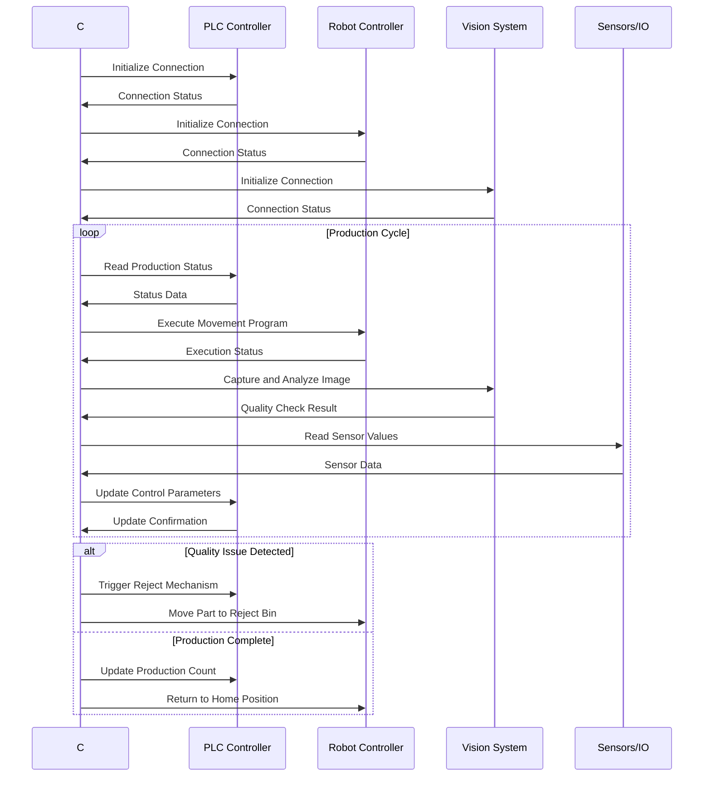

```mermaid
sequenceDiagram
    participant CS as C# Control System
    participant PLC as PLC Controller
    participant Robot as Robot Controller
    participant Vision as Vision System
    participant Sensors as Sensors/IO
    
    CS->>PLC: Initialize Connection
    PLC->>CS: Connection Status
    
    CS->>Robot: Initialize Connection
    Robot->>CS: Connection Status
    
    CS->>Vision: Initialize Connection
    Vision->>CS: Connection Status
    
    loop Production Cycle
        CS->>PLC: Read Production Status
        PLC->>CS: Status Data
        
        CS->>Robot: Execute Movement Program
        Robot->>CS: Execution Status
        
        CS->>Vision: Capture and Analyze Image
        Vision->>CS: Quality Check Result
        
        CS->>Sensors: Read Sensor Values
        Sensors->>CS: Sensor Data
        
        CS->>PLC: Update Control Parameters
        PLC->>CS: Update Confirmation
    end
    
    alt Quality Issue Detected
        CS->>PLC: Trigger Reject Mechanism
        CS->>Robot: Move Part to Reject Bin
    else Production Complete
        CS->>PLC: Update Production Count
        CS->>Robot: Return to Home Position
    end
```