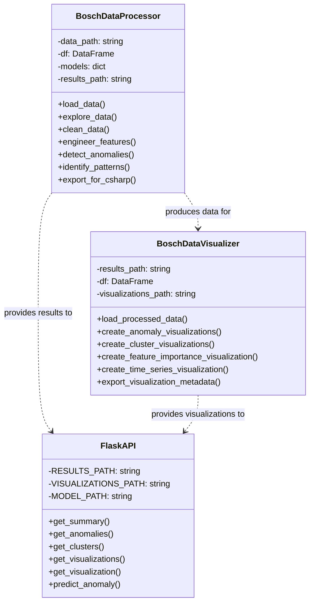

```mermaid
classDiagram
    class BoschDataProcessor {
        #45;data_path: string
        #45;df: DataFrame
        #45;models: dict
        #45;results_path: string
        #43;load_data()
        #43;explore_data()
        #43;clean_data()
        #43;engineer_features()
        #43;detect_anomalies()
        #43;identify_patterns()
        #43;export_for_csharp()
    }
    
    class BoschDataVisualizer {
        #45;results_path: string
        #45;df: DataFrame
        #45;visualizations_path: string
        #43;load_processed_data()
        #43;create_anomaly_visualizations()
        #43;create_cluster_visualizations()
        #43;create_feature_importance_visualization()
        #43;create_time_series_visualization()
        #43;export_visualization_metadata()
    }
    
    class FlaskAPI {
        #45;RESULTS_PATH: string
        #45;VISUALIZATIONS_PATH: string
        #45;MODEL_PATH: string
        #43;get_summary()
        #43;get_anomalies()
        #43;get_clusters()
        #43;get_visualizations()
        #43;get_visualization()
        #43;predict_anomaly()
    }
    
    BoschDataProcessor ..> BoschDataVisualizer : produces data for
    BoschDataProcessor ..> FlaskAPI : provides results to
    BoschDataVisualizer ..> FlaskAPI : provides visualizations to
```