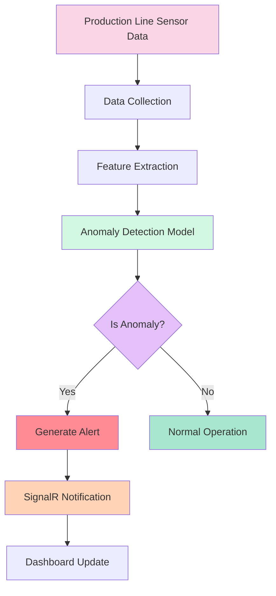

```mermaid
graph TD;
    A["Production Line Sensor Data"]-->B["Data Collection"]
    B-->C["Feature Extraction"]
    C-->D["Anomaly Detection Model"]
    D-->E{"Is Anomaly?"}
    E-->|Yes|F["Generate Alert"]
    E-->|No|G["Normal Operation"]
    F-->H["SignalR Notification"]
    H-->I["Dashboard Update"]
    
    style A fill:#f9d5e5
    style D fill:#d3f8e2
    style E fill:#e4c1f9
    style F fill:#ff8b94
    style G fill:#a8e6cf
    style H fill:#ffd3b6
```