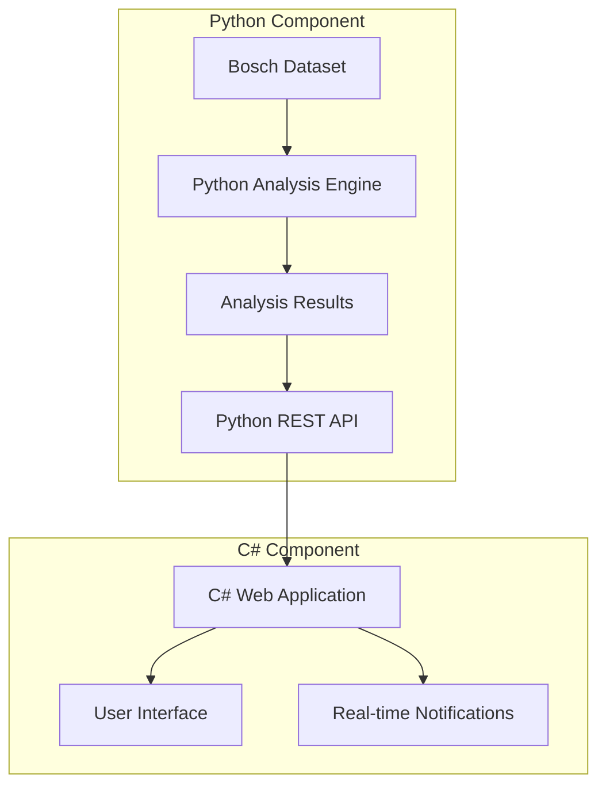

```mermaid
graph TD;
    A["Bosch Dataset"]-->B["Python Analysis Engine"]
    B-->C["Analysis Results"]
    C-->D["Python REST API"]
    D-->E["C# Web Application"]
    E-->F["User Interface"]
    E-->G["Real-time Notifications"]
    
    subgraph "Python Component"
    A
    B
    C
    D
    end
    
    subgraph "C# Component"
    E
    F
    G
    end
```